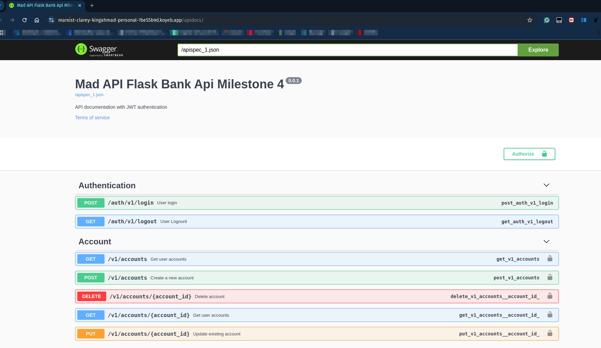
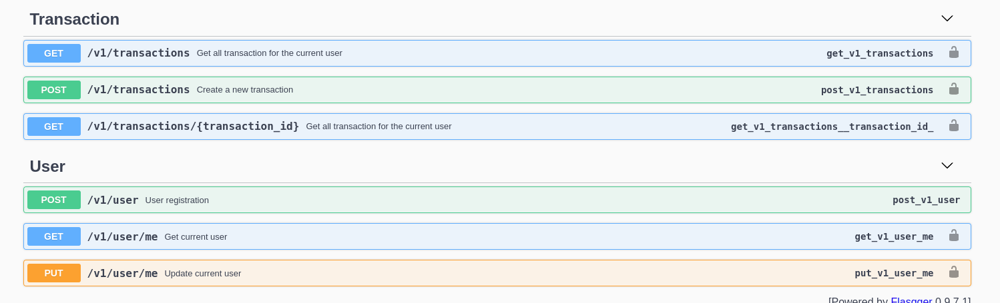

# Banking API Milestone Project 4

## Tech Stack
- Flask
- Pyenv with python 3.12 => Python versioning control
- Poetry => Python project management
- flasgger => API Documentation
- PyMysql => Connector to MySQL database
- PyJWT => For jwt authentication service
- hypercorn => Asynchronous like to spawn the service
- filess.io => Free database hosting

## Endpoint Requirements
#### Authentication and Authorization:
- POST /v1/register: Create User account
- POST /v1/login: Login existing account and return the JWT Token
- GET /v1/logout (optional): Logout and clear current user session

#### User Management:
- GET /v1/users/me: Retrieve the profile of the currently authenticated user
- PUT /v1/users/me: Update the profile information of the current user

#### Account Management
- GET /v1/accounts: Retrive a list of all accounts belonging to the currently authenticated user.
- GET /v1/accounts/:id: Retrieve details of a specific account by its ID (authorized to the account owner).
- POST /v1/accounts: Create a new account for the currently authenticated user
- PUT /v1/accounts/:id: Update the account number of account for the currently authenticated user
- DELETE /v1/accounts/:id: Delete an account of the authenticated user (authorized account required)

#### Transaction Management
- GET /v1/transactions: Retrieve a list of all transactions for the currently authenticated user.
- GET /v1/transactions/:id: Retrieve details of a specific account transaction (authorized for the related account)
- POST /v1/transactions: Initiate a new transaction (deposit, withdraw, transfer). Authorized for the related user account

## Account Type
- checking/transactional, can do withdrawal, deposit, and transfer
- saving, can do only deposit transaction

## Transaction validation
1. Transfer

    **Parameter**: *from_account_id*, *to_account_id*, *amount*

    Validation Steps:

    1. Validate currently used account (must used a checking account type)
    2. Validate the total balance of the currently *checking* account
    3. Validate the destination account transfer (the destination account must a *checking* account type)
    4. Do the transfer activity and record the transaction to the database if all conditions are pass

2. Withdrawal

    **Parameter**: *from_account_id*, *to_account_id*, *amount*

    Validation Steps:

    1. Validate the *from_account_id* and *to_account_id*, must used the same ID
    2. Validate currently used account (must used a checking account type)
    3. Validate the destination account, must the same account *checking* type from the related owner
    4. Validate the balance of the source account ID
    5. Do the withdrawal activity and record the transaction to the database if all the conditions are pass

3. Deposit

    **Parameter**: *from_account_id*, *to_account_id*, *amount*

    Validation Steps:

    1. Validate the *from_account_id* and *to_account_id*, must used the same ID
    2. Validate currently used account, must used the same account type (checking or saving)
    3. Validate the destination account, must the same account type from the related owner
    4. Validate the balance of the source account ID
    5. Do the deposit activity and record the transaction to the database if all the conditions are pass


## Development

Requirements:

    1. Python 3.12
    2. poetry
    3. MySQL 8.x database
    
 
- clone or fork this repository

    `git clone https://github.com/kingahmadr/milestone-4-kingahmadr.git`

- checkout a new branch

    `git checkout -b dev`

- Run poetry install 

    `poetry install`

- Config the .env, adjust it from the .env.example file

- Run DB migration

    ```
    flask db init # you may need to delete the migrations directory first

    flask db migrate -m "Initial migrate"

    flask db upgrade
    ```

- Predifine Role 

    ```
    INSERT INTO roles (name, slug)
    VALUES ('Administrator', 'admin'), ('User', 'user');
    ```

- Run the flask service, e.g

    `hypercorn app:app --bind 127.0.0.1:5100 --reload` 

- Happy develop !!


## Deployment

#### Koyeb deployment
see my Dockerfile for image build step

#### Deployment link and the API Docs

[https://marxist-clarey-kingahmad-personal-7be55b9d.koyeb.app/apidocs](https://marxist-clarey-kingahmad-personal-7be55b9d.koyeb.app/apidocs)


## API Snippet






